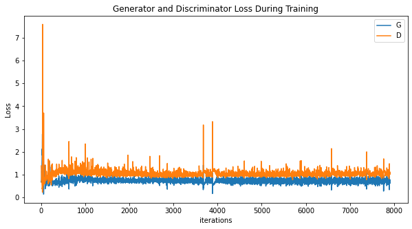
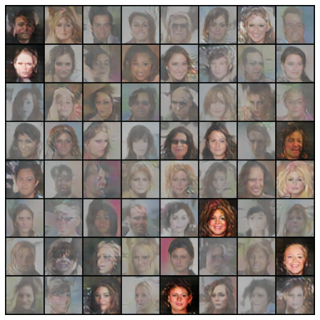
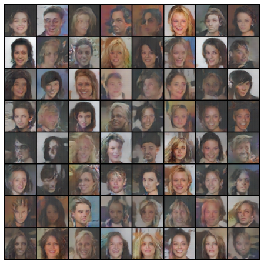

# Unsupervised Representation Learning with Deep Convolutional Generative Adversarial Network (DCGAN) implementation
This is an implementation of the research paper <a href = "https://arxiv.org/abs/1511.06434.pdf">"Unsupervised Representation Learning with Deep Convolutional Generative Adversarial Networks"</a> written by Alec Radford, Luke Metz, Soumith Chintala.

## Dataset
The original paper had used three datasets for training the DCGAN namely - *Large-scale Scene Understanding (LSUN) (Yu et al., 2015), Imagenet-1k and a newly assembled Faces dataset*. However due to computational and other limitations, we have used <a href = "http://mmlab.ie.cuhk.edu.hk/projects/CelebA.html">Large-scale CelebFaces Attributes (CelebA) Dataset</a>.

### Citation
``` 
@inproceedings{liu2015faceattributes,
 title = {Deep Learning Face Attributes in the Wild},
 author = {Liu, Ziwei and Luo, Ping and Wang, Xiaogang and Tang, Xiaoou},
 booktitle = {Proceedings of International Conference on Computer Vision (ICCV)},
 month = {December},
 year = {2015} 
}
``` 
### Guidelines to download, setup and use the dataset
The CelebA dataset may be downloaded <a href = "https://drive.google.com/file/d/1yW6QkWcd6sWYB2rw9d-A36woiXVLTpny/view?usp=sharing">here</a> as a file named *img_align_celeba.zip*. 

**Please write the following commands on your terminal to extract the file in the proper directory**
```
$ mkdir celeba
$ unzip </path/to/img_align_celeba.zip> -d </path/to/celeba>
```
The resulting directory structure should be:
```
/path/to/celeba
    -> img_align_celeba
        -> 188242.jpg
        -> 173822.jpg
        -> 284702.jpg
        -> 537394.jpg
           ...
```
<br>

**Note**: You may use any other dataset of your choice. However, please ensure that the directory structure remains the same for the code to be compatible with it. 

## Installation and Usage Guidelines
To use the repo and generate your own images please follow the guidelines below


- Cloning the Repository: 

        git clone https://github.com/indiradutta/DC_GAN
        
- Entering the directory: 

        cd DC_GAN
        
- Setting up the Python Environment with dependencies:

        pip install -r requirements.txt

- Running the file:

        python3 test.py
        

Check out the demo notebook <a href = 'https://github.com/indiradutta/DC_GAN/blob/main/demo/dcgan_demo.ipynb'>here</a>.

**Note**: Is is advisable to use a GPU for training because training the DCGAN is computationally very expensive
<hr>

## Results from Implementation

- Plot to see how D and G’s losses changed during training



- Batches of fake data from G

 &nbsp; &nbsp; 

- Training progression of G


https://user-images.githubusercontent.com/66861243/117669333-67e99600-b1c4-11eb-885c-bcb5e4b7b299.mp4

## Contributors

- <a href = "https://github.com/indiradutta">Indira Dutta</a>
- <a href = "https://github.com/srijarkoroy">Srijarko Roy</a>
